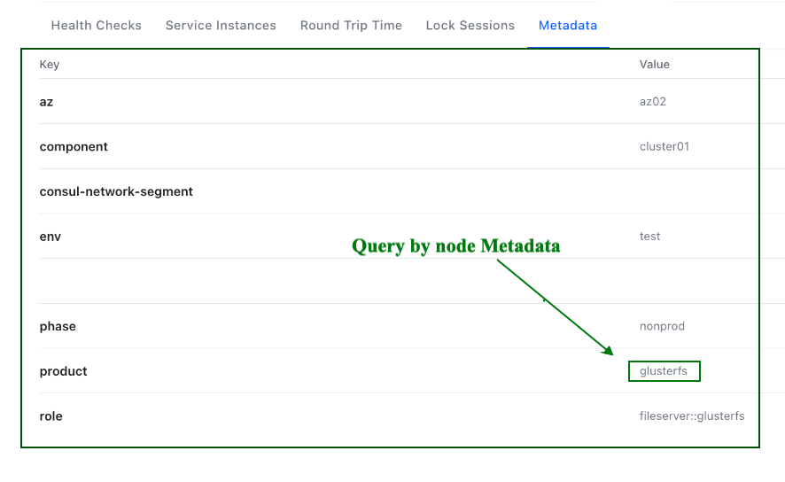

# Ansible in-memory plugin for Consul

This repository is a POC on how to build an [in-memory inventory](https://docs.ansible.com/ansible/latest/collections/ansible/builtin/add_host_module.html) for Ansible using Consul.

## Action Plugin
Action plugin runs on the host and as access to vars.
Action plugins can also trigger module using _execute_module method.

## Action Plugin: in_memory_inventory

The **in_memory_inventory** action plugin will use Consul Node Metadada to execute queries.

In the example we are targeting the **product** metadata property.

###




Calling the action plugin, **in_memory_inventory**, will require **node_meta** property with consul node metadata pairs to match.

Use **groups** to create an Ansible inventory group for the matching nodes.

```
- name: Load GlusterFS nodes
  in_memory_inventory:
    consul: "{{ consul }}"
    groups: "glusterfs"
    node_meta:
      product: "glusterfs"
```

#### Update var.yaml file
```
consul:
  url: myconsul.server
```


# Sources:
* https://docs.ansible.com/ansible/latest/dev_guide/developing_plugins.html#action-plugins
* https://docs.ansible.com/ansible/latest/collections/ansible/builtin/add_host_module.html
